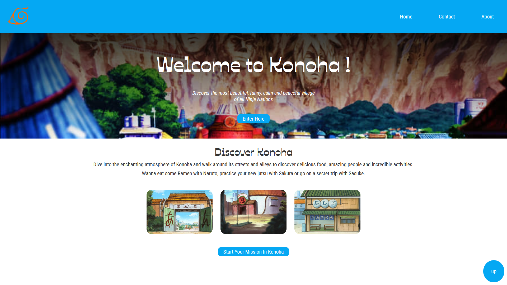
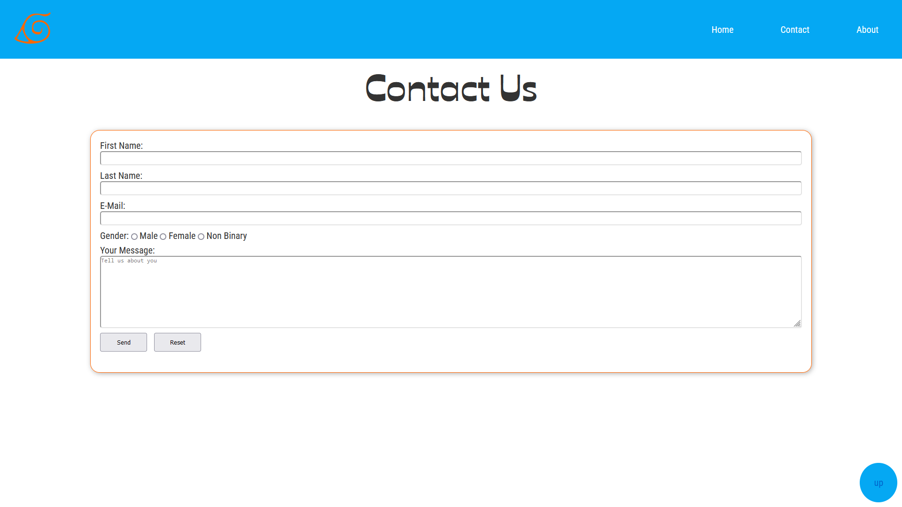
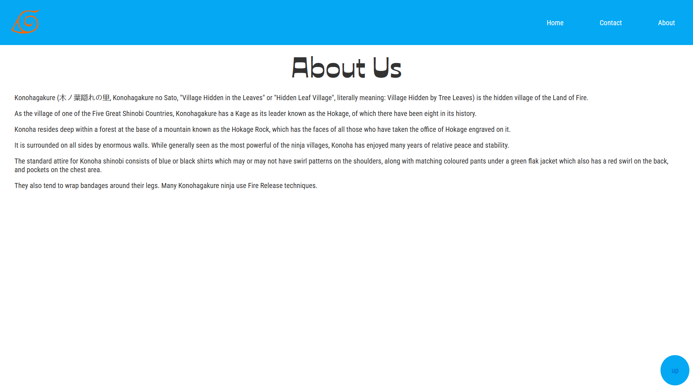

# Informations about this project :

This is a Practice Project done in `htlm`, `css` and `js` to practice responsive designs, UI and UX.

I wanted to add a personal touch by making a regular tour website into something funnier with the use of my other passion that is Anime.

---

[Click Here](https://sassid.github.io/Konoha-Tour/) to check it out now ! 😁

---

---

_See you soon for some more projects_
